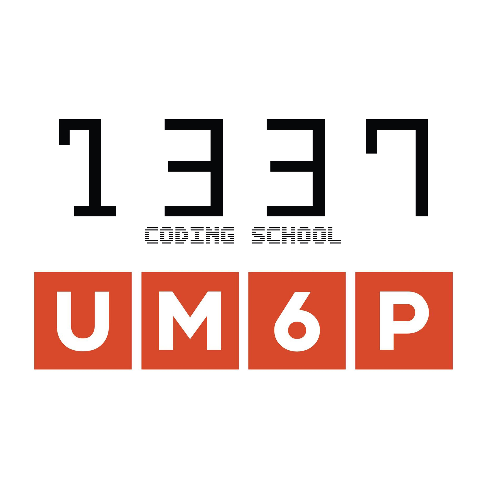

<h1 style="color:red;" align="center" style="color: red;"> 𝑯𝒊 👋 , 𝑰'𝒎 𝑨𝒃𝒅𝑬𝒔𝒔𝒂𝒎𝒂𝒅   </h1>

  

- 👨‍💻 𝑰’𝒎 𝒄𝒖𝒓𝒓𝒆𝒏𝒕𝒍𝒚 𝒂 𝑺𝒕𝒖𝒅𝒆𝒏𝒕 𝒊𝒏 1337 𝒔𝒄𝒉𝒐𝒐𝒍 𝒂𝒕 𝑴𝒐𝒉𝒂𝒎𝒎𝒆𝒅 𝑽𝑰 𝑷𝒐𝒍𝒚𝒕𝒆𝒄𝒉𝒏𝒊𝒄 𝑼𝒏𝒊𝒗𝒆𝒓𝒔𝒊𝒕𝒚.

 &nbsp; &nbsp; &nbsp; &nbsp; &nbsp; &nbsp; &nbsp; &nbsp; &nbsp; &nbsp; &nbsp;  &nbsp; &nbsp; &nbsp; &nbsp; &nbsp; &nbsp; &nbsp; &nbsp; &nbsp; &nbsp; &nbsp; &nbsp; &nbsp; &nbsp; &nbsp; &nbsp; &nbsp; &nbsp; &nbsp; &nbsp; &nbsp; &nbsp;  
 - 🧰 𝑳𝒂𝒏𝒈𝒖𝒂𝒈𝒆𝒔 𝒂𝒏𝒅 𝑻𝒐𝒐𝒍𝒔 :

   &nbsp; &nbsp; &nbsp; &nbsp; &nbsp; &nbsp; &nbsp; &nbsp; &nbsp; &nbsp; &nbsp; &nbsp; &nbsp; &nbsp; &nbsp; &nbsp; &nbsp; &nbsp; &nbsp; &nbsp; &nbsp; &nbsp;  &nbsp;  &nbsp;  
 </h2>
